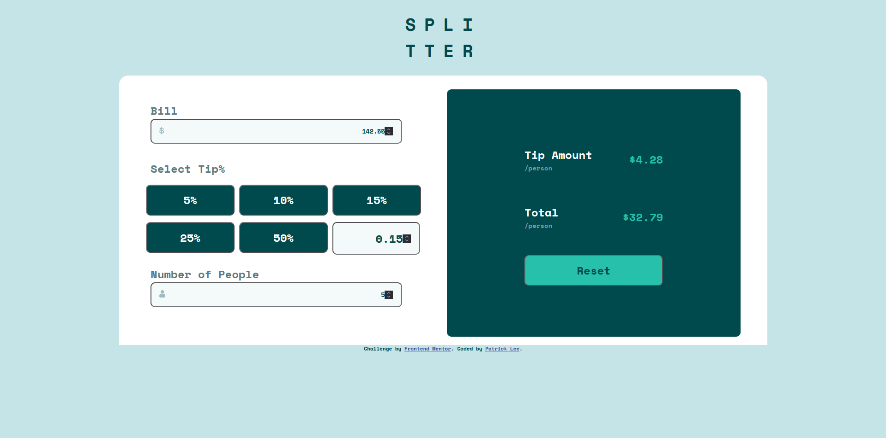

# Frontend Mentor - Tip calculator app solution

This is a solution to the [Tip calculator app challenge on Frontend Mentor](https://www.frontendmentor.io/challenges/tip-calculator-app-ugJNGbJUX). Frontend Mentor challenges help you improve your coding skills by building realistic projects.

## Table of contents

- [Overview](#overview)
  - [The challenge](#the-challenge)
  - [Screenshot](#screenshot)
  - [Links](#links)
- [My process](#my-process)
  - [Built with](#built-with)
  - [What I learned](#what-i-learned)
  - [Continued development](#continued-development)
  - [Useful resources](#useful-resources)
- [Author](#author)
- [Acknowledgments](#acknowledgments)

**Note: Delete this note and update the table of contents based on what sections you keep.**

## Overview

### The challenge

Users should be able to:

- View the optimal layout for the app depending on their device's screen size
- See hover states for all interactive elements on the page
- Calculate the correct tip and total cost of the bill per person

### Screenshot

### Links

- Solution URL: [Github](https://github.com/PatrickLee22/tip-calculator-app)
- Live Site URL: [Github Pages](https://patricklee22.github.io/tip-calculator-app/)

## My process

### Built with

- Typescript
- [React](https://reactjs.org/) - JS library
- [Styled Components](https://styled-components.com/) - For styles

**Note: These are just examples. Delete this note and replace the list above with your own choices**

### What I learned

This was this first attempt writing a project in Typescript. I wanted to take advantage of an Interface to declare the state variable's type. I could've used a Type alias instead, but I wanted to have take advangtage of the interface's declaration merging feature just in case. 

While I was writing the code, I learned that the useEffect() hook would execute every time the application renders. I wanted to update the state a every call to useEffect(), but I quickly learned that this would trigger an infinite loop. Due to the fact that each of the "Inputs" React Components (ie. Bills, Tips, and NumPeople) would be responsible for updating a respective state variable, my solution was to move away from the useEffect() hook and write a unique function for each React Component that updates the state. 

## Author

- Frontend Mentor - [@PatrickLee22](https://www.frontendmentor.io/profile/PatrickLee22)
- Github - [PatrickLee22](https://github.com/PatrickLee22)